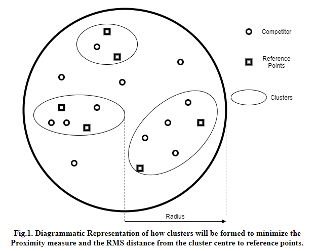
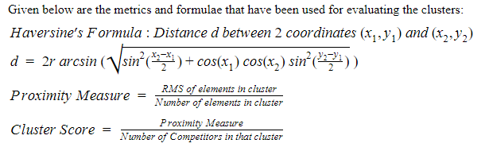
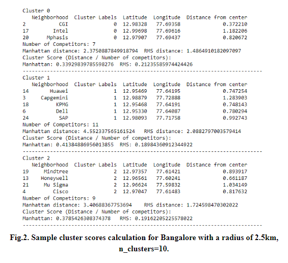
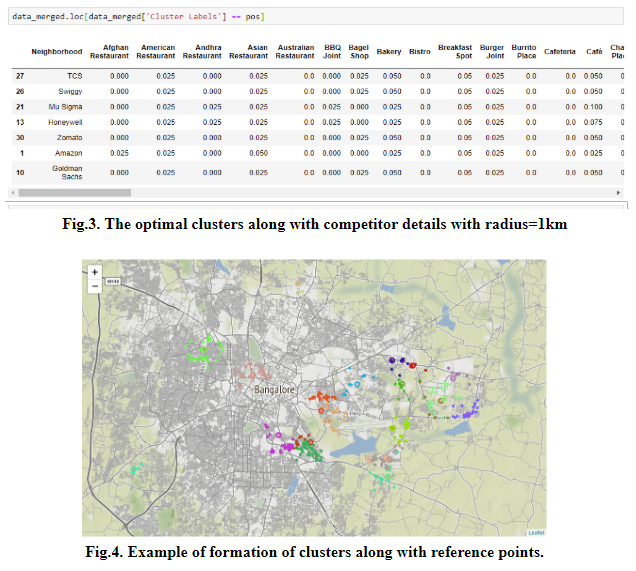

# Set-My-Biz
An application to help you find the best place to set up your business.

**Languages Used:** Python, HTML, CSS, JavaScript.

**Diagrammatic Explanation:**

**Metrics used for evaluating Clusters:**

**Example of Cluster formation:**

Best cluster will be the one having the least Cluster Score.

The Manhattan and RMS distance is computed for clusters and used each cluster score calculation. The clusters that have only a single reference point in them have been neglected since their cluster score will be zero.

The Model returns the latitude and longitude of the place that is suitable for entrepreneurs to set up a new business. This place involves less risk and is capable of attracting more customers thereby increasing profits. The place returned has a proper balance between the number of competitors in its vicinity and the target audience. It minimizes the number of competitors while maximizing the number of reference points in its vicinity. Each cluster will return the latitude, longitude and the RMS of the distances from the reference point to the centre of that cluster. 
